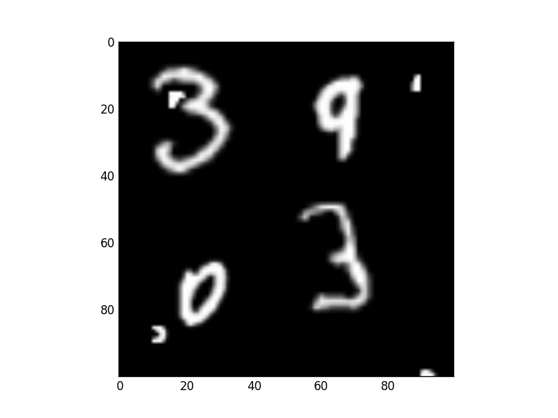
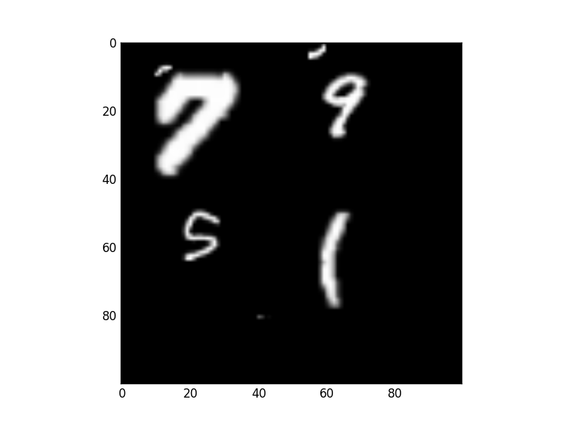
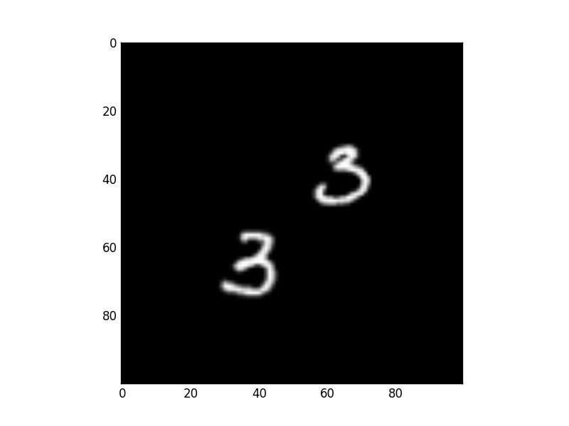
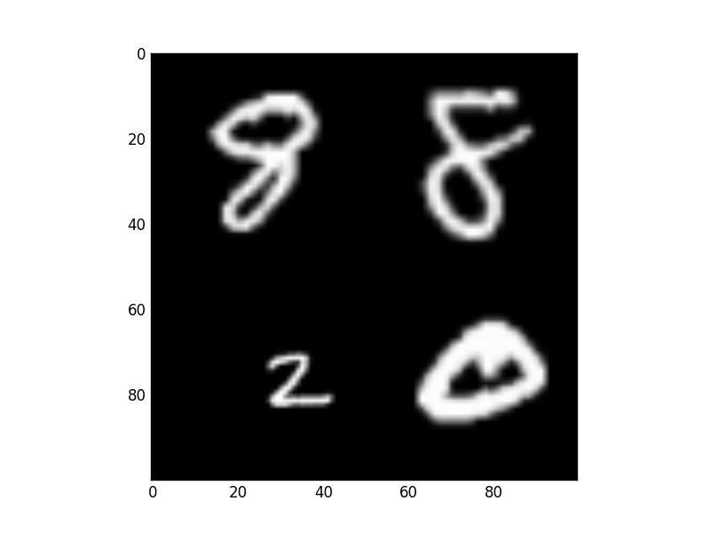
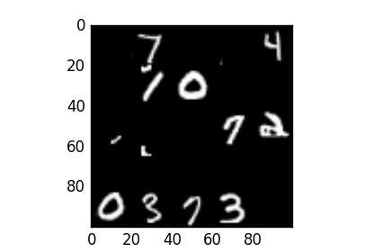
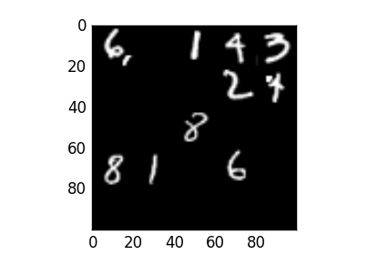

# MNIST Multiset

This repo contains a script to generate MNIST Multiset datasets, e.g. as used in [Saliency-based Sequential Image Attention with Multiset Prediction](https://arxiv.org/abs/1711.05165) and [Loss Functions for Multiset Prediction](https://arxiv.org/abs/1711.05246).

Each dataset contains images with a possibly variable number of digits that can vary in size and can have clutter. Each image has a multiset of label and bounding box annotations. 

Dataset variations can be created for multiset, set, and sequence prediction, with varying levels of difficulty. This class of datasets can also be useful for evaluating generalization to different sequence lengths.

## Examples
#### 4 digits, 20-50px digit size, with clutter
```bash
python mnist_multi.py --min-digits 4 --max-digits 4 \
                      --min-digit-size 20 --max-digit-size 50 \
                      --tag min20_max50_4 --output-dir output/
```


#### 1-4 digits, 20-50px digit size, without clutter
```bash
python mnist_multi.py --min-digits 1 --max-digits 4 \
                      --min-digit-size 20 --max-digit-size 50 \
                      --min-num-clutter 0 --max-num-clutter 0 \
                      --tag min20_max50_1_4 --output-dir output/
```


#### 10 digits, 20px digit size, with clutter
```bash
python mnist_multi.py --min-digits 10 --max-digits 10 \
                      --min-digit-size 20 --max-digit-size 20 \
                      --tag min20_max20_10 --output-dir output/
```


Many other variations are possible (please see the available flags with `python mnist_multi.py -h`), including:

* `--set`: no duplicate labels in an image
* `--img-width`: change the size of output images

## Loading

`util.py` contains a function to load MNIST Multi into a `PyTorch` `Dataset`. 

Using the `label_order` flag, labels can be ordered randomly, or used for sequence prediction by ordering the labels spatially, by object area, or according to a fixed random ordering. 

To evaluate invariance to label ordering, use `randomize_dataset=True`, which will re-randomize the label order every time a minibatch is drawn.
